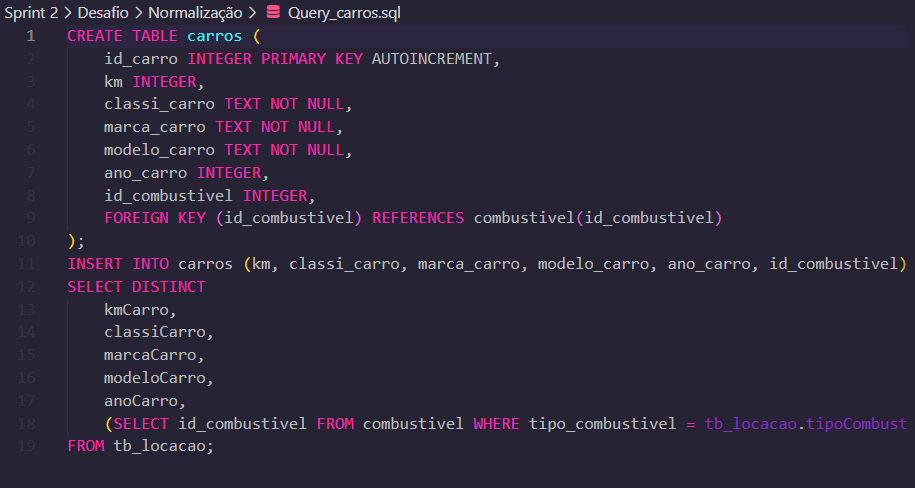

# Desafio da Sprint 2

## Descrição
Neste desafio, recebi um banco de dados que contia apenas um tabela. A partir dessa tabela, realizei o processo de normalização para garantir a atomização dos dados e dividi a tabela em original em várias tabelas menores, otimizando o armazenamento e a integridade dos dados.

### Primeira Etapa do desafio 
1- **Normalização**
O processo de normalização foi realizado em multiplas fases, como o objetivo de eliminar redundâncias e garantir a cosistência dos dados, a tabela primaria foi desmembradas nas seguintes tabelas:

-Combustivel 

-Carros

-Vendedor

-Cliente

-Locacao 

- **Resultado**

### Segunda parte do desafio 

Após a normalização, o banco de dados foi reorganizado em um modelo dimensional, com a tabela locacao funcionando como a tabela fato, enquanto as outras tabelas (carros, vendedor, cliente, combustivel) foram transformadas em tabelas dimensão.

- **Resultado**

