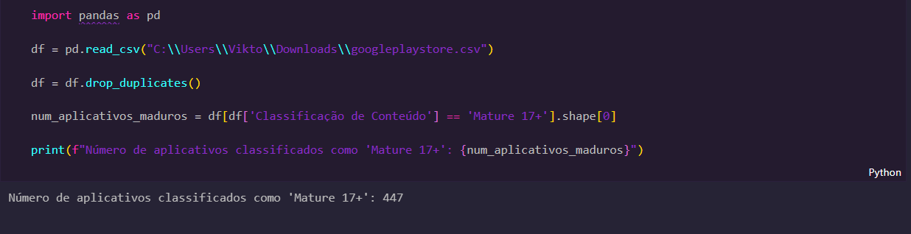

# Desafio 

Neste desafio nos foi dado um arquivo csv onde contava um banco de dados sobre aplicativos da loja google, a google playstore. apartir dai foram dadas instruçoes para a filtragem de resultados e a criação de certos graficos, tudo isso utilizando o jupyter notebook 

## Instruções 

- Remover as linhas duplicadas 

- Fazer um gráfico de barras contendo os top 5 apps por número de instalação.

- fazer um gráfico de pizza mostrando as categorias de apps existentes no datasetde acordo com a frequência em que elas aparecem. 

- Mostrar o app mais caro existente no dataset.

- Mostrar quantos apps são classificados como 'Mature 17+'. 

- Mostre o top 10 apps por número de reviews bem como o respectivo número de reviews. Ordene a lista de forma decrescente por número de reviews. 

- Criar pelo menos mais 2 cálculos sobre o dataset e apresente um em forma de lista e outro em formato de valor. 

Criar pelo menos outras 2 formas gráficas de exibição dos indicadores acima utilizando a biblioteca matplotlib. com gráficos diferentes dos já utilizados anteriormente.

  

 

