# Desafio 
------------------------------------------------------------------------------------------
## Resumo
------------------------------------------------------------------------------------------
Neste desafio utilizei o 'Docker' para executar arquivos python, o primeiro sendo
fornecido pelo o desafio e o segundo seria criado por mim para fazer o mesmo. 

### Primeira etapa 
------------------------------------------------------------------------------------------
#### Resumo:
Nessa etapa recebi um arquivo chamado **'carguru.py'** que me retornava um string aleatoria de uma lista e apartir dela realizar as intruções: 
##### Instruções: 
- Construir uma imagem a partir de um arquivo dockerfile que execute o arquivo que baixei (carguru.py). Após execute um container a partir da imagem criada  

##### Execução:
criação da imagem a partir do arquivo parte 1
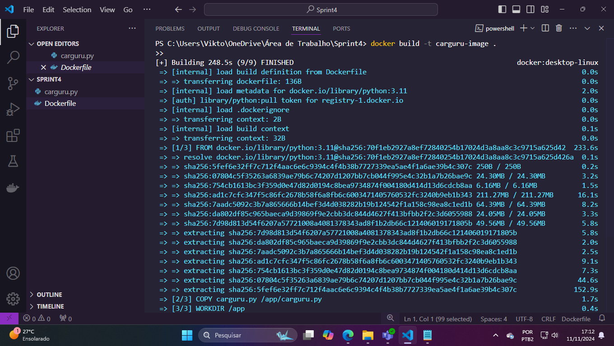
criação da imagem a partir do arquivo parte 2 
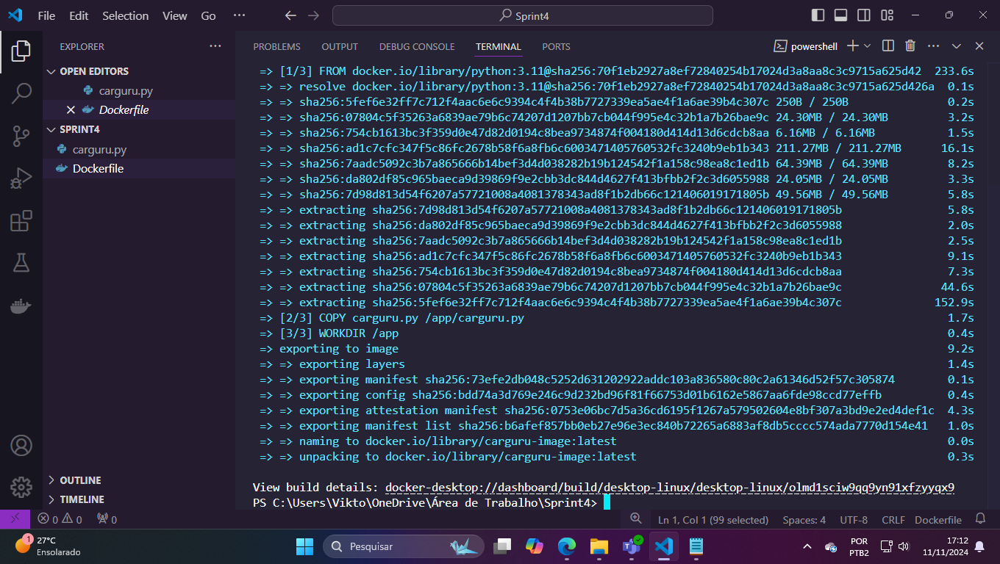 
Aqui está a prova da criação do container 
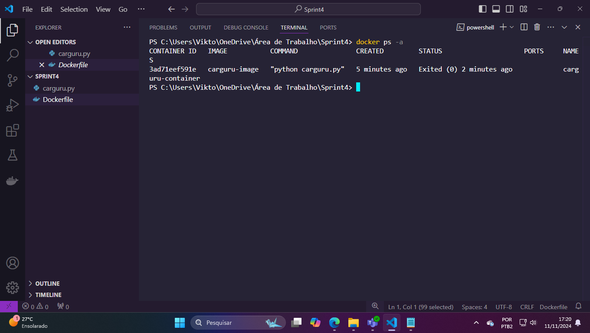 
Execução do container pela imagem 
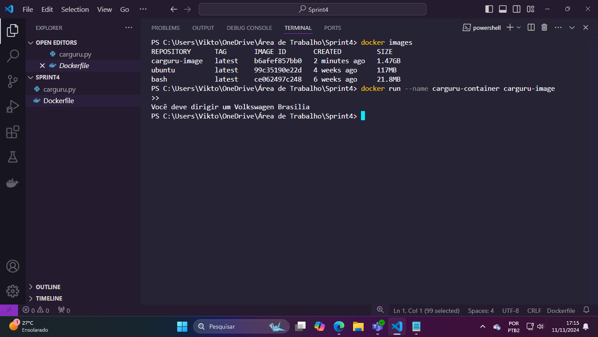 

### Segunda etapa
------------------------------------------------------------------------------------------

#### Instruções
É possível reutilizar containers? Em caso positivo, apresente o comando necessário para reiniciar um dos containers parados em seu ambiente Docker? Não sendo possível reutilizar, justifique sua resposta. 

##### Resposta:
------------------------------------------------------------------------------------------

Sim é possivel, pode se utilizar o comando: **"Docker restart (nome do container)/ (id do container)"**
ou se quiser executalo interativamente utiliza-se o comando:
**"Docker start -i (nome do container) / (id do container)"**  

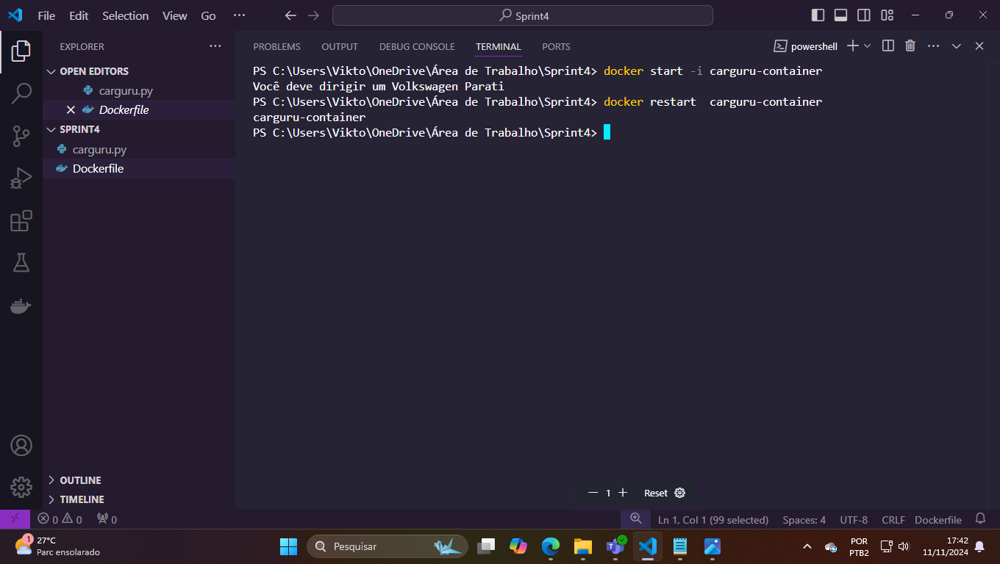

### Terceira etapa
Aqui eu deveria fazer exatamete oque fiz na primeira etapa porém com um codigo criado por mim. 

#### Instruções 
- Agora vamos exercitar a criação de um container que permita receber inputs durante sua execução. Abaixo seguem as instruções. 

1.Criar novo script Python que implementa o algoritmo a seguir:
	- Receber uma string via input.
	- Gerar o Hash da string por meio do algoritmo SHA-1
	- Imprimir o hash em tela, utilizando o método hexdigest 
	- retornar ao passo 1

2- Criar uma imagem Docker chamada mascarar-dados que execute o script python criado anteriormente.

3-Iniciar um container a partir da imagem, enviando algumas palavras para mascararamento.

4-Registrar o conteúdo do script Python, arquivo Dockerfile e comando de inicialização do container neste espaço 

------------------------------------------------------------------------------------------

*Script Python* 

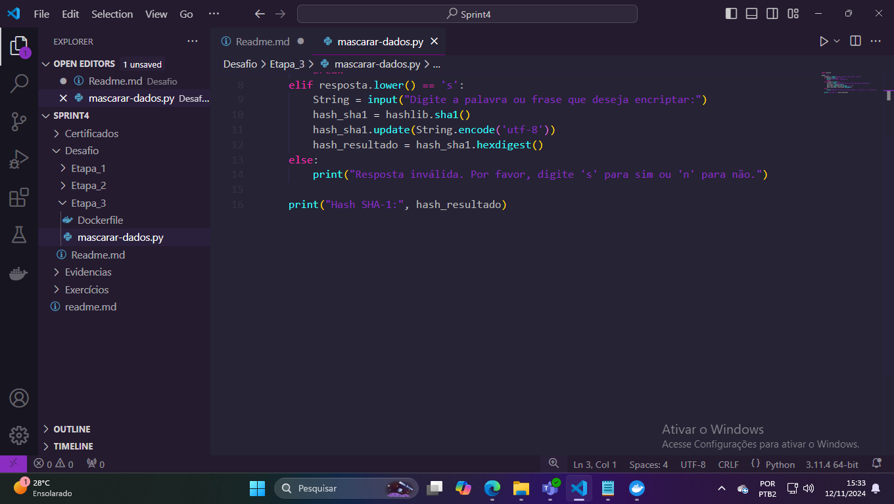

*Script sendo executado fora do docker*

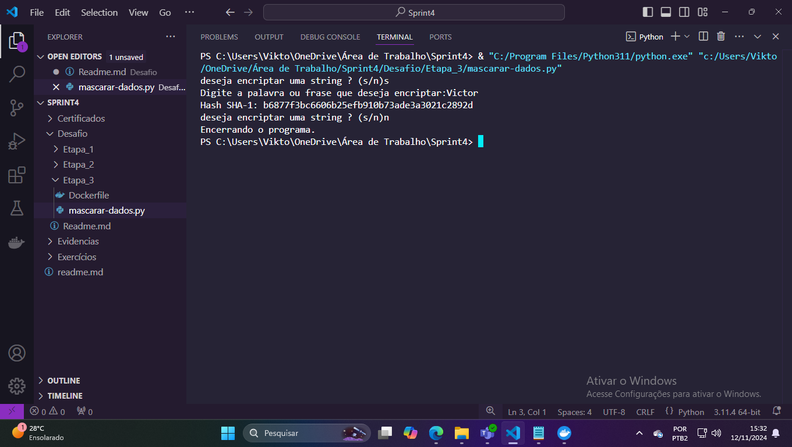 

*Criação da imagem* 

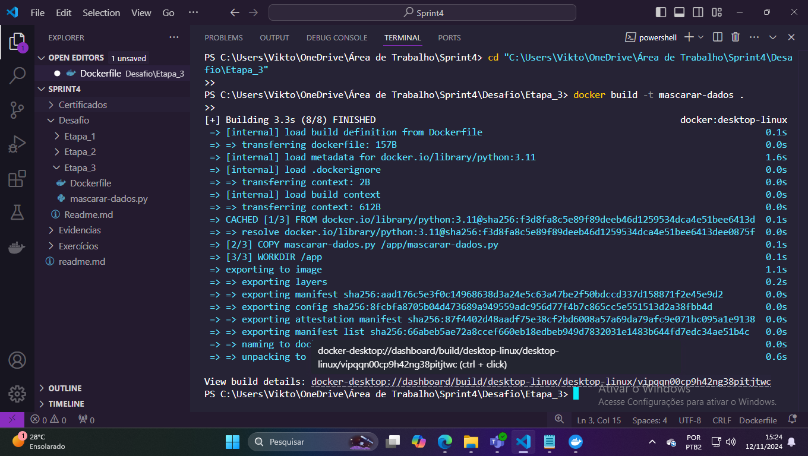 

*Execução pela imagem* 

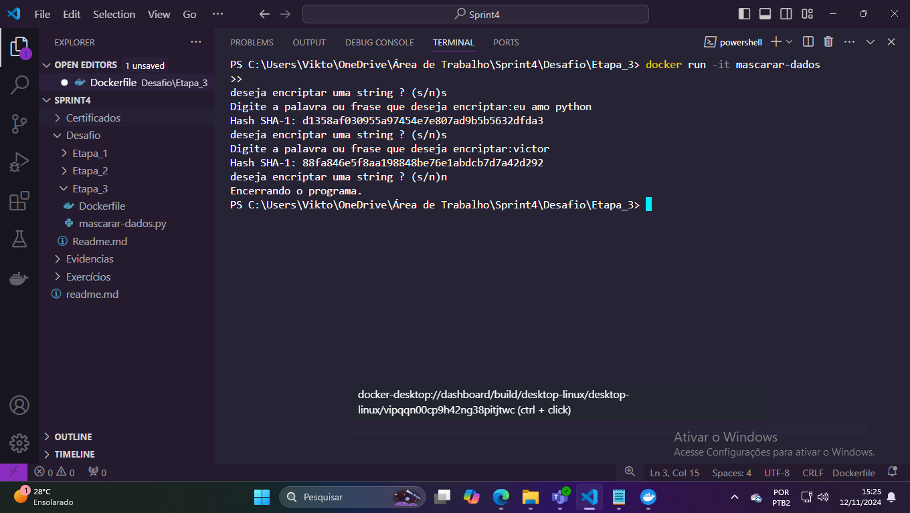 

*Prova da inicialização da terceira etapa pelo container*

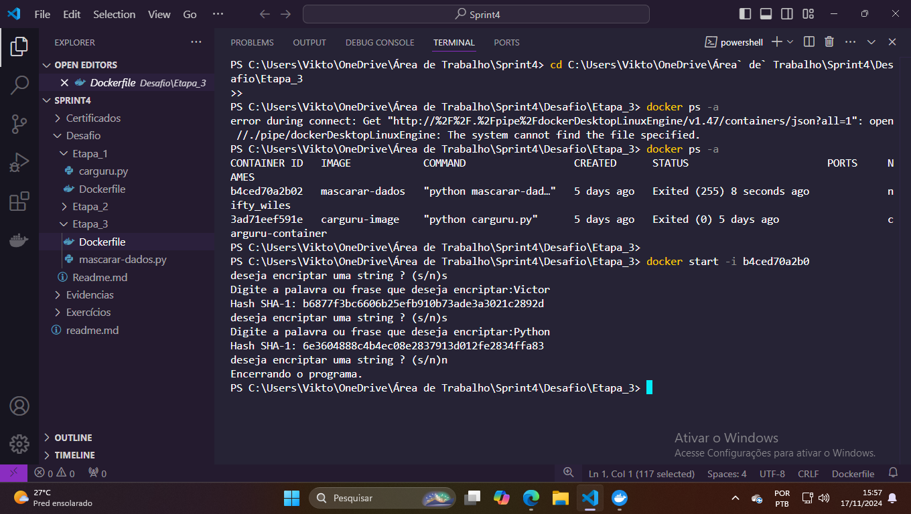

*Prova da existencia da imagem e do container* 

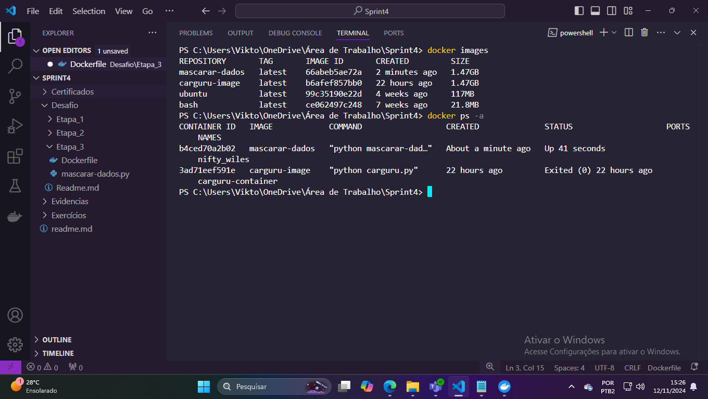
