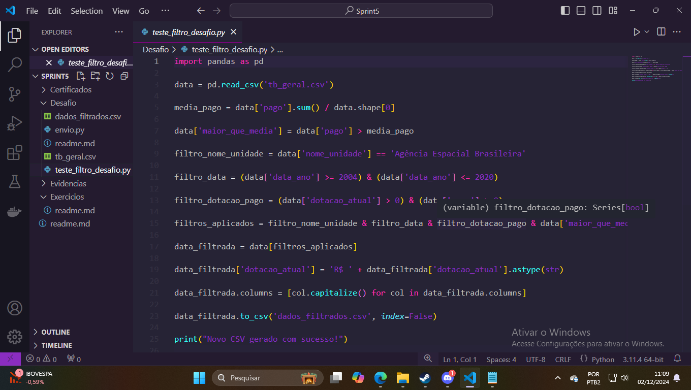
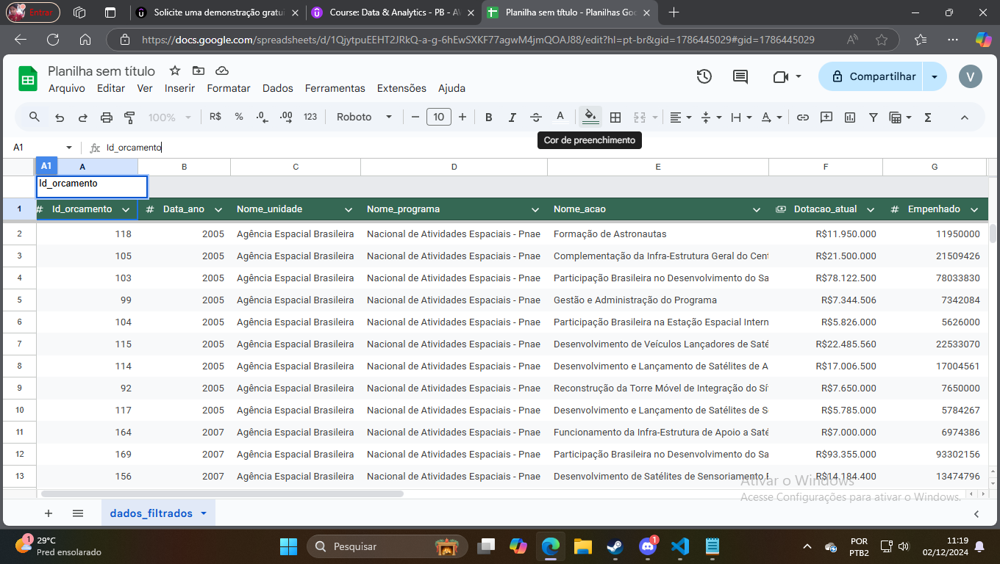
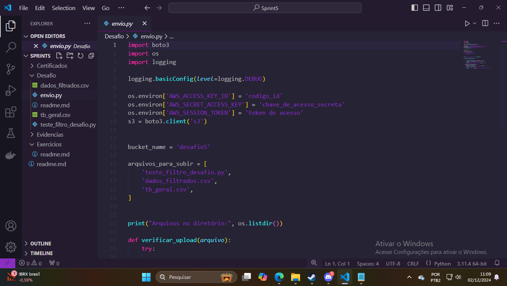
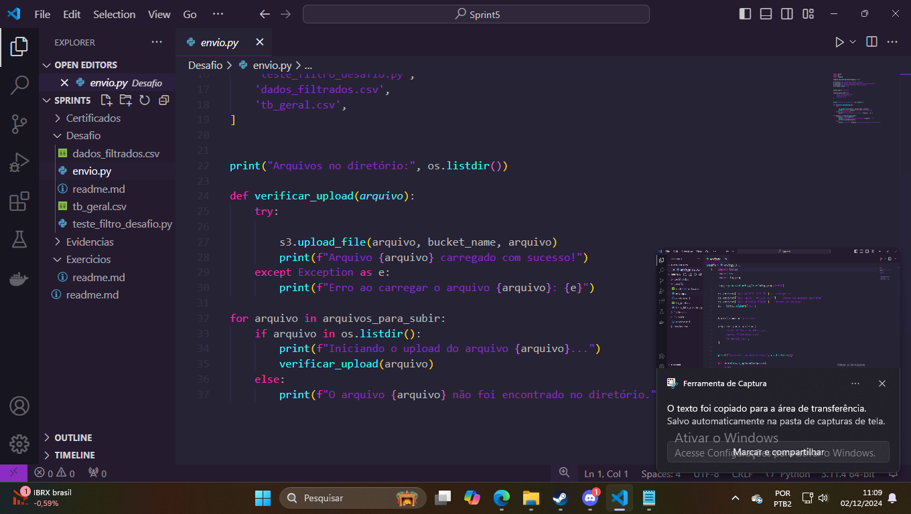
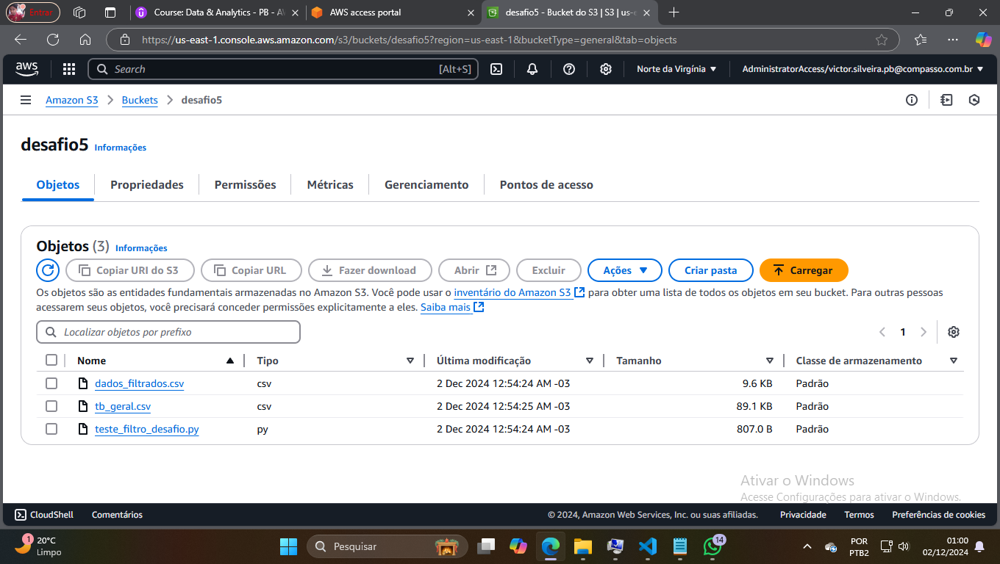

# Desafio 

Esse desafio consistia em obter um data frame que estava no site do gov e manipulalo de certas maneiras e colocalo em um novo bucket no s3, esssa segunda parte utilizando o boto3 

------------------------------------------------------------------------------------------------

# O script python precisa realizar as seguintes manipulações:

- Uma cláusula que filtra dados usando ao menos dois operadores lógicos 

- Duas funções de agregração 

- uma função condicional 

- uma função de conversão 

- uma função de data

- uma função de string  

 

esse foi o codigo que utilizei para realizar cada uma das filtragens  

o novo csv ficou assim 

 

após a manipulção ter sido feita utilizei um codigo para enviar, e para isso precisei baixar o Amazon CLI e configurar minhas credenciais apartir do aws cinfigure  

 
 

Essa segunda parte do codigo existe para que eu tenha uma noção se deu certo ou não, pois algumas das vezes que tentei sem ele, estava dando erro e eu não tinha um feedback. 

no final o bucket estava assim 

