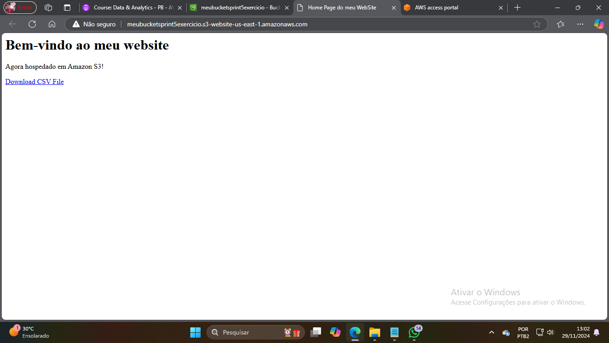

# **Exercicio** 

Nesse exercicio tive que criar um bucket que hospeda um site estático, os arquivos html foram disponibilizados e esses foram os resultados dos exercicio 

### **Link do site** 
- http://meubucketsprint5exercicio.s3-website-us-east-1.amazonaws.com 

 

 

 