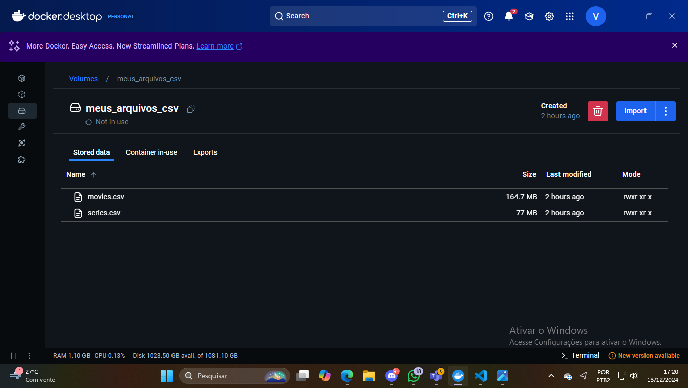
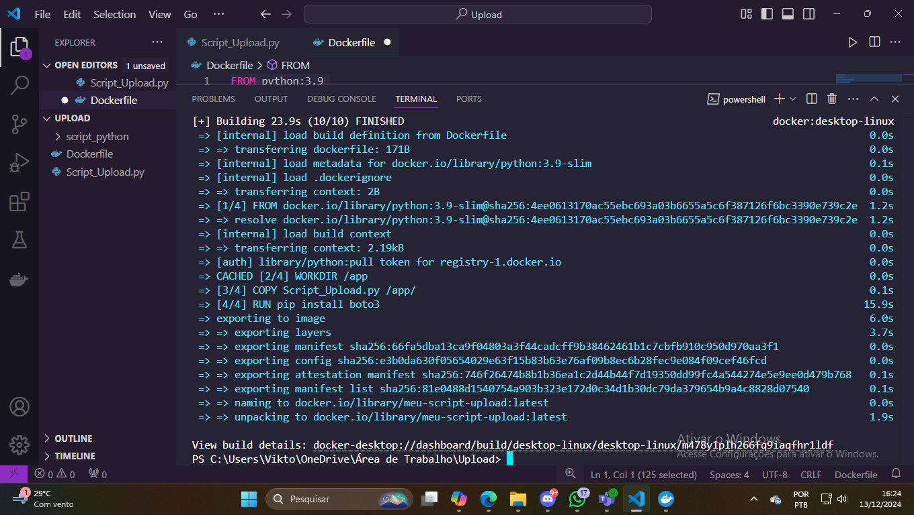
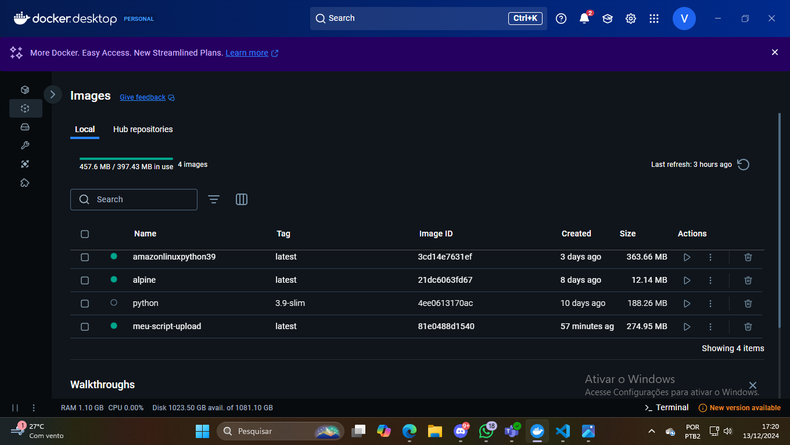
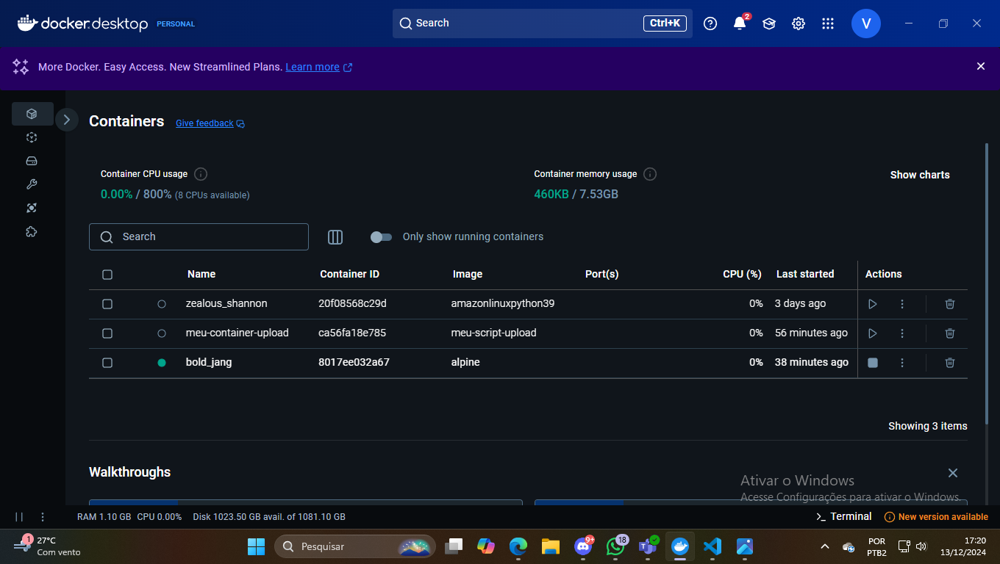
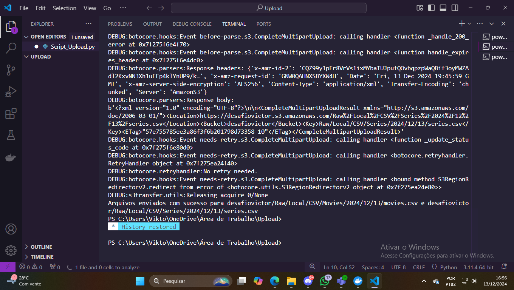
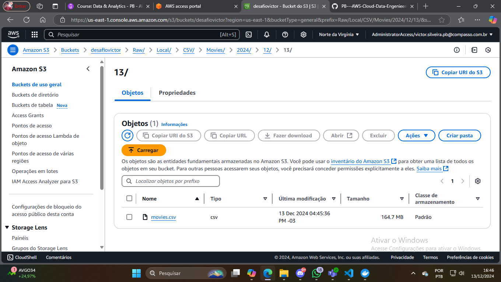
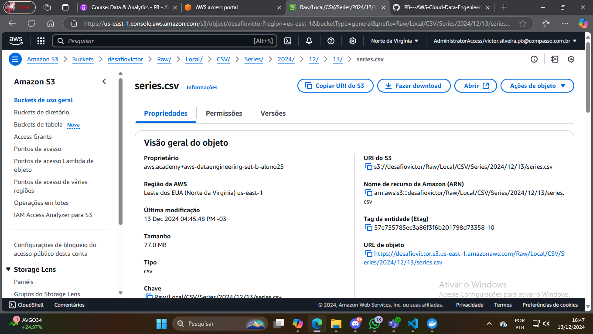

# **Desafio** 

Neste desafio recebi dois arquivos csv, chamados de "movies.csv" e "series.csv" e deveria criar um bucket, e armazenar esses csv's nele por meio de um script pyhton. 
------------------------------------------------------------------------------------------------

## **Perguntas** 
-Qual é a média das notas dos filmes e séries lançados em países que estavam em conflito ou guerra no ano de lançamento?
- Quais são os países com o maior número de filmes ou séries altamente avaliados durante períodos de guerra ou pós-guerra?
- Como a nota média de filmes e séries variou em relação ao ano de lançamento em países que passaram por guerras em comparação com países em paz no mesmo período?
- Quais diretores ou estúdios são responsáveis por mais produções durante períodos de guerra em seus países, e como essas produções foram avaliadas? 

------------------------------------------------------------------------------------------------

## **Execução**

Esse script pyhton seria iniciado pelo docker. 

e esse foi o Script

[Script](Script_Upload.py)

Os arquivos csv seriam armazenados em um volume, e o codigo iria buscar eles no volume 

 

depois era criada a imagem e o container 

 
 

e com o script sendo executado 

 
