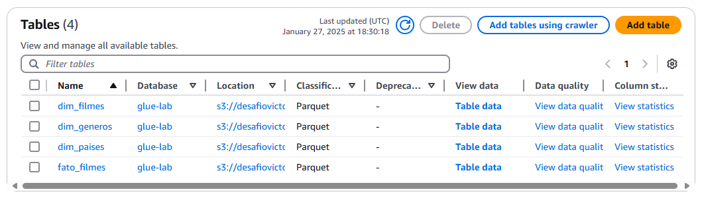
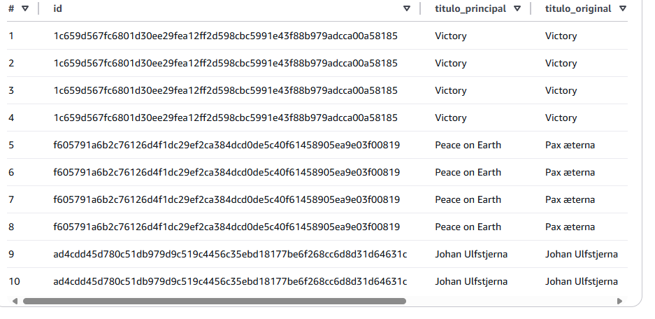
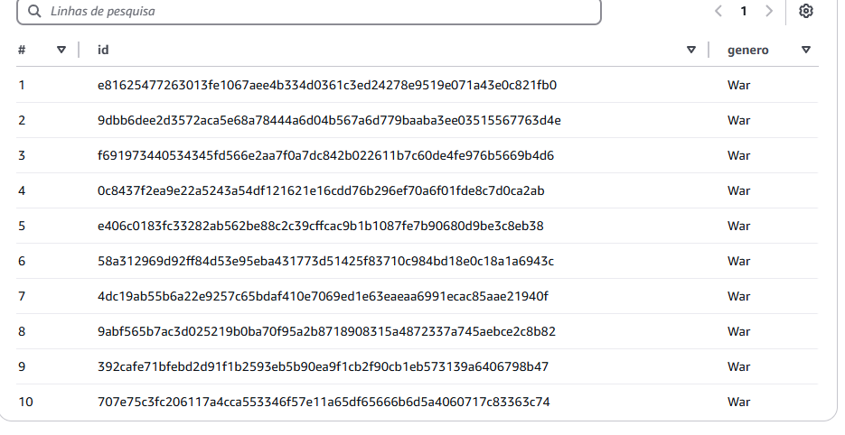
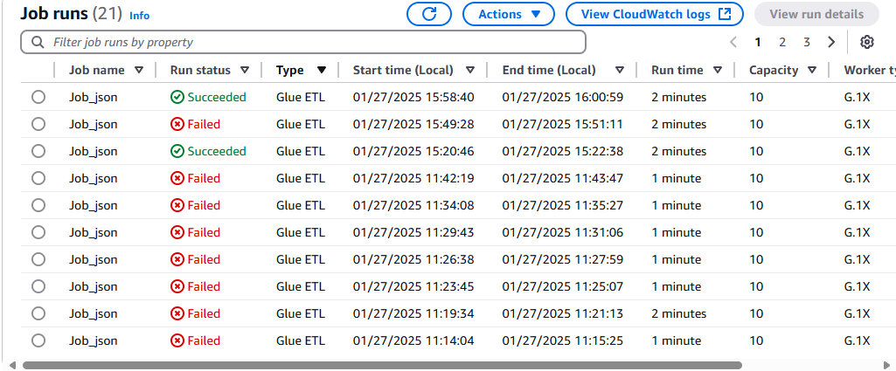
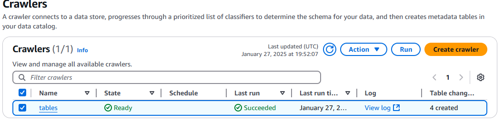
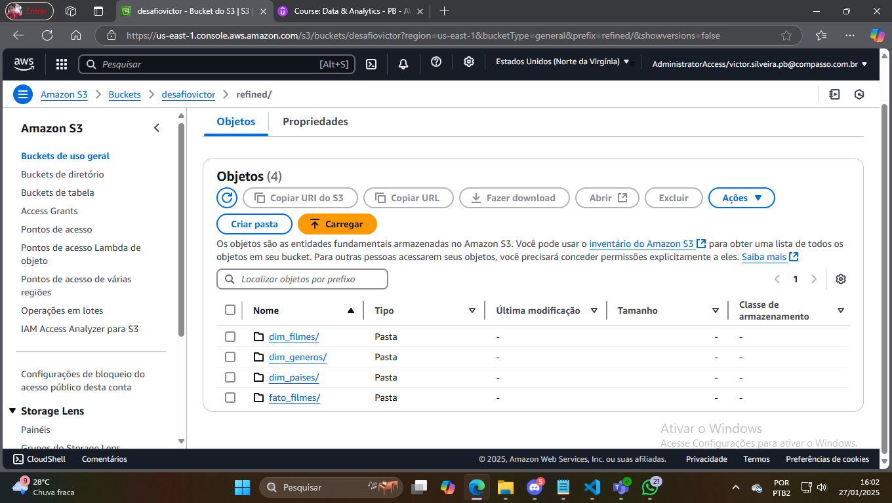

Este job processa dados de filmes de duas fontes (CSV e JSON), realizando transformações como renomeação de colunas, conversão de datas e expansão de listas. Ele cria tabelas de dimensões (gêneros, países, filmes) e uma tabela de fatos detalhada sobre os filmes. Os resultados são gravados em Parquet no S3 para uso em análises futuras.

Codigo:
[codigo](../Desafio/Desafio.py)

Tabelas Criadas:

 

 

Job Executado com Sucesso:

Crawler:

Bucket Refined: 
